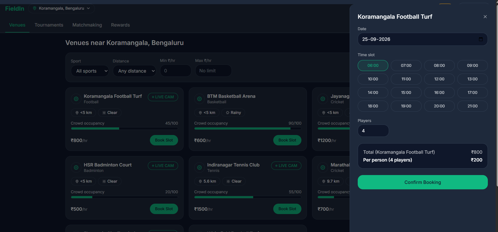
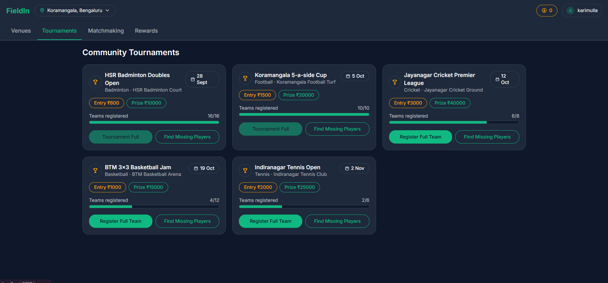
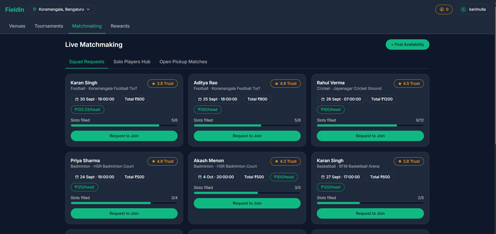
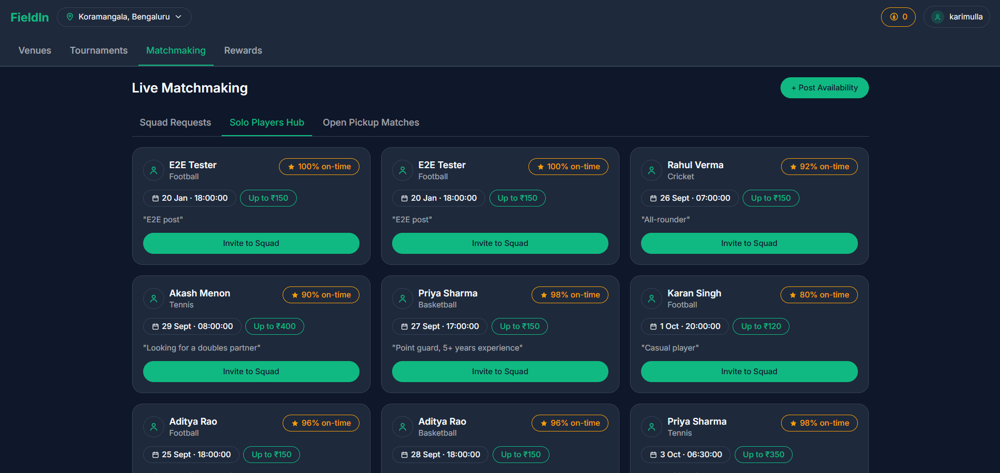
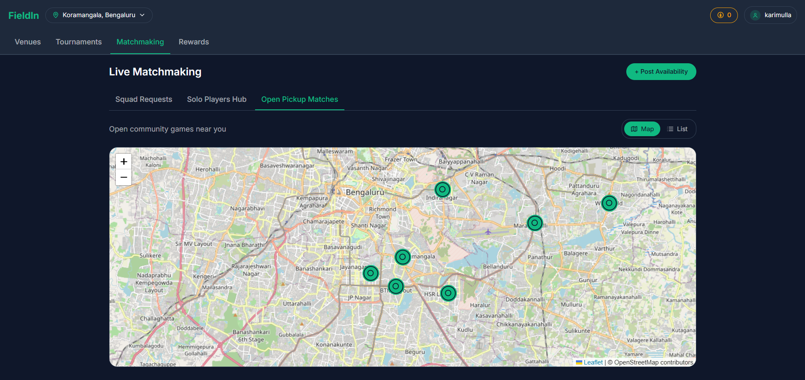
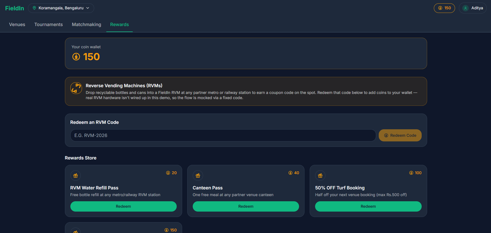

# FieldIn

FieldIn is a hyper-local sports platform: find and book venues near you, fill squad gaps via live two-way
player matchmaking, and earn eco-gamified coins from Reverse Vending Machines (RVMs) that you can spend in
a rewards store. This repo is a full-stack prototype covering all four modules from the assignment brief:
Venues & Booking, Tournaments, Matchmaking (with Socket.IO live updates), and Rewards.

## Screenshots

**Module 1 — Venues & Booking Drawer**


**Module 2 — Tournaments**


**Module 3 — Matchmaking: Squad Requests**


**Module 3 — Matchmaking: Solo Players**


**Module 3 — Matchmaking: Open Pickup Matches**


**Module 4 — Rewards**


## Tech Stack

- **Frontend:** Next.js 14 (App Router), Tailwind CSS, Zustand, TanStack Query, Socket.IO client, Leaflet + OpenStreetMap
- **Backend:** Node.js + Express, Socket.IO, JWT + bcrypt
- **Database:** PostgreSQL 16 + PostGIS (geospatial venue queries)
- **Cache / Locking:** Redis (10-minute slot hold on booking)

## Prerequisites

- Node.js 20+
- npm 10+
- Docker Desktop (for Postgres + Redis via `docker-compose.yml`) **or** a local PostgreSQL 16 (with the
  PostGIS extension available) and Redis 7 instance

## Quick Start (one command)

The whole stack — Postgres, Redis, backend, and frontend — can be started from the project root with a
single command. This is the recommended way to run the app day to day.

```bash
npm install     # root only: installs the orchestrator (concurrently), doesn't touch backend/ or frontend/
npm run setup   # first time only: creates backend/.env and frontend/.env.local from their .env.example files
```

Open `backend/.env` and set `JWT_SECRET` to any random string (only needed once), then:

```bash
npm run dev
```

This single command:
1. Starts Postgres (PostGIS) + Redis via `docker compose up -d --wait`, blocking until both report healthy
2. Starts the backend API (`tsx watch`) on http://localhost:4000
3. Starts the frontend (`next dev`) on http://localhost:3000
4. Streams all three logs together in one terminal, color-coded and prefixed (`[docker]` / `[backend]` / `[frontend]`)

The first time only, seed the database once the backend is up (new terminal, from the project root):

```bash
npm --prefix backend run seed
```

Then open **http://localhost:3000**.

**To stop:**

| Command | What it stops |
| --- | --- |
| `Ctrl+C` in the `npm run dev` terminal | Backend and frontend dev servers |
| `npm run stop` (from the project root) | Postgres + Redis containers |

Postgres/Redis are deliberately left running after `Ctrl+C` so your seeded data survives between dev
sessions — run `npm run stop` when you're fully done. `docker-compose.yml`, `backend/`, and `frontend/`
are unchanged by this — the root `package.json` and `scripts/setup.js` just orchestrate the same commands
documented below, in one terminal instead of three.

## Manual setup (equivalent, one service at a time)

Useful if you want to run or debug a single service on its own instead of the full stack together.

### 1. Start Postgres + Redis

```bash
docker compose up -d
```

This starts `postgis/postgis:16-3.4` on `localhost:5432` (db `fieldin`, user/pass `postgres`/`postgres`) and
`redis:7-alpine` on `localhost:6379`. If you'd rather run your own Postgres/Redis, just point the `.env`
files (below) at them instead.

### 2. Backend setup

```bash
cd backend
cp .env.example .env   # fill in JWT_SECRET with any random string
npm install
npm run seed            # drops + recreates the schema and loads demo data
npm run dev              # starts the API on http://localhost:4000
```

`npm run seed` is safe to re-run any time — it drops and recreates the `public` schema before reapplying
`db/schema.sql` and `db/seed.sql`, so the database always ends up fully seeded and usable immediately.

### Demo accounts

Every seeded user shares the password `Password123!`:

| Email | Notes |
| --- | --- |
| aditya@fieldin.dev | Healthy coin balance — demos a successful voucher redemption |
| meera@fieldin.dev | Low coin balance (10) — demos the "insufficient coins" error path |
| rahul@fieldin.dev | Mid balance, squad captain in several matchmaking listings |
| akash@fieldin.dev / priya@fieldin.dev / karan@fieldin.dev / sanjay@fieldin.dev | Additional seeded athletes used across tournaments/matchmaking |

### 3. Frontend setup

```bash
cd frontend
cp .env.example .env.local
npm install
npm run dev   # starts the app on http://localhost:3000
```

Open http://localhost:3000 — it redirects to `/venues`. Log in with any demo account above.

## Project Structure

```
package.json        root orchestrator only (concurrently) — starts docker + backend + frontend together
scripts/setup.js     creates backend/.env and frontend/.env.local from .env.example on first run
docker-compose.yml   Postgres (PostGIS) + Redis, with healthchecks so `--wait` works
backend/
  db/               schema.sql, seed.sql, run-seed.ts
  src/
    config/         db (pg Pool), redis, env
    controllers/     one per resource
    services/        query/business logic, called by controllers
    routes/          Express routers, mounted in app.ts
    middleware/       requireAuth (JWT), centralized error handler
    sockets/         Socket.IO server + broadcast() helper
frontend/
  src/
    app/             Next.js App Router pages (venues, tournaments, matchmaking, rewards, auth)
    components/      layout/shared/venues/tournaments/matchmaking/rewards, grouped by module
    hooks/           TanStack Query hooks per resource
    store/           Zustand stores (auth, ui/location/matchmaking filter)
    lib/             apiClient (fetch wrapper + JWT), socket (Socket.IO client singleton)
```

## Design decisions & mocked pieces

A few things are intentionally mocked or simplified, isolated so the rest of the app stays fully functional:

- **RVM hardware**: there's no real reverse vending machine to integrate with, so redemption is a fixed
  demo code (`RVM-2026` → +25 coins) rather than a hardware webhook. `POST /api/rewards/redeem-code`
  validates against a small in-memory code table — swapping in a real RVM webhook later just means adding a
  new source that calls the same coin-transaction/wallet-update logic.
- **Weather & crowd occupancy**: static demo values seeded per venue rather than a live weather API or IoT
  occupancy sensor feed, per the brief's "mock live indicator" allowance for LIVE CAM.
- **Live cam**: UI-only badge, as instructed — no actual video stream.
- **Open Pickup Matches**: the brief doesn't define a separate "pickup match" table, so this sub-tab reuses
  the same `squad_requests` data (open games with a real venue location), rendered as a Leaflet map with
  custom inline-SVG markers plus a list-view toggle.
- **Athlete Resume Drawer chat**: the chat panel is a local mock (no persistent messaging backend/table) —
  it simulates the "Invite to Squad" conversation the brief describes, with a canned auto-reply.
- **Two extra tables beyond the brief's minimum schema** — `tournament_registrations` and
  `squad_join_requests` — track *who* registered/joined so "Register Full Team" and "Request to Join" are
  real, idempotent actions (can't double-register, can't double-join) instead of unguarded counters.

## API Endpoints

All responses are JSON. Authenticated routes require `Authorization: Bearer <accessToken>`.

### Auth

Access tokens are short-lived JWTs (`JWT_EXPIRES_IN`, default 15m). Refresh tokens are opaque,
Redis-backed, and rotate on every use (`JWT_REFRESH_EXPIRES_IN_DAYS`, default 30d) — each refresh
invalidates the token that was just used and returns a new one, so a leaked/replayed refresh token
stops working the moment the legitimate client refreshes.

**POST `/api/auth/register`**
```json
// Request
{ "name": "Aditya Rao", "email": "aditya@fieldin.dev", "password": "Password123!" }
// 201 Response
{ "accessToken": "eyJhbGciOi...", "refreshToken": "6f589f15...", "user": { "id": "...", "name": "Aditya Rao", "email": "aditya@fieldin.dev", "coinsBalance": 0, "trustScore": 5, "punctualityRate": 100, "sportPreferences": [] } }
```

**POST `/api/auth/login`**
```json
// Request
{ "email": "aditya@fieldin.dev", "password": "Password123!" }
// 200 Response
{ "accessToken": "eyJhbGciOi...", "refreshToken": "dc37834b...", "user": { "id": "...", "name": "Aditya Rao", "coinsBalance": 150, "...": "..." } }
```

**POST `/api/auth/refresh`** — verifies + rotates a refresh token, issues a new access token
```json
// Request
{ "refreshToken": "dc37834b..." }
// 200 Response
{ "accessToken": "eyJhbGciOi...", "refreshToken": "5507bdaa..." }
// 401 if the refresh token is invalid, expired, already rotated, or revoked
{ "error": "Invalid or expired refresh token" }
```

**POST `/api/auth/logout`** — revokes a refresh token server-side
```json
// Request
{ "refreshToken": "5507bdaa..." }
// 204 No Content
```

The frontend's `apiFetch` wrapper (`frontend/src/lib/apiClient.ts`) calls `/api/auth/refresh`
automatically on any `401` and retries the original request once with the new access token —
callers never see the 401 unless the refresh token itself is also invalid/expired, in which case
the session is cleared and the user is redirected to `/login`.

### Users

**GET `/api/users/profile`** (auth)
```json
// 200 Response
{ "id": "...", "name": "Aditya Rao", "email": "aditya@fieldin.dev", "coinsBalance": 150, "trustScore": 4.8, "punctualityRate": 96, "sportPreferences": ["Football", "Cricket"], "createdAt": "2026-09-01T00:00:00.000Z" }
```

### Venues (Module 1)

**GET `/api/venues?sport=Football&maxDistance=5&minPrice=0&maxPrice=1000&lat=12.9352&lng=77.6146`**
```json
// 200 Response
{ "venues": [ { "id": "...", "name": "Koramangala Football Turf", "sportType": "Football", "hourlyRate": 800, "crowdOccupancy": 45, "weatherCondition": "Clear", "hasLiveCam": true, "distanceKm": 0.0, "lat": 12.9352, "lng": 77.6146 } ] }
```

**GET `/api/venues/:id`**
```json
// 200 Response
{ "venue": { "id": "...", "name": "Koramangala Football Turf", "sportType": "Football", "hourlyRate": 800, "crowdOccupancy": 45 } }
```

### Bookings (Module 1)

**POST `/api/bookings`** (auth) — acquires a 10-minute Redis slot lock before writing the row
```json
// Request
{ "venueId": "a1111111-0000-0000-0000-000000000001", "slotDate": "2026-09-25", "slotStart": "18:00", "slotEnd": "19:00", "playerCount": 4 }
// 201 Response
{ "booking": { "id": "...", "venueId": "...", "totalAmount": 800, "perHeadAmount": 200, "playerCount": 4, "status": "confirmed" } }
// 409 if the slot is already locked/booked
{ "error": "This slot is currently being held by another booking. Try again shortly." }
```

### Tournaments (Module 2)

**GET `/api/tournaments`**
```json
{ "tournaments": [ { "id": "...", "title": "Koramangala 5-a-side Cup", "sportType": "Football", "venueName": "Koramangala Football Turf", "startDate": "2026-10-05", "entryFee": 1500, "maxTeams": 10, "registeredTeams": 8, "prizePool": 20000, "status": "open" } ] }
```

**POST `/api/tournaments/:id/register`** (auth)
```json
// Request
{ "teamName": "Koramangala Strikers" }
// 201 Response
{ "tournament": { "id": "...", "registeredTeams": 9, "maxTeams": 10 } }
// 409 if full or already registered
{ "error": "This tournament is already full" }
```

### Matchmaking (Module 3, live via Socket.IO)

**GET `/api/matchmaking/squads`**
```json
{ "squads": [ { "id": "...", "captainName": "Aditya Rao", "captainTrustScore": 4.8, "venueName": "Koramangala Football Turf", "sportType": "Football", "slotDate": "2026-09-25", "slotStart": "18:00", "totalCost": 800, "perHeadCost": 100, "slotsTotal": 8, "slotsFilled": 5, "status": "open" } ] }
```

**GET `/api/matchmaking/solo`**
```json
{ "solo": [ { "id": "...", "userName": "Meera Nair", "trustScore": 4.2, "punctualityRate": 88, "sportType": "Badminton", "availableDate": "2026-09-24", "availableTime": "19:00", "maxBudget": 200, "notes": "Intermediate level" } ] }
```

**POST `/api/matchmaking/post`** (auth) — posts a squad request or solo availability; broadcasts
`matchmaking:squad:new` / `matchmaking:solo:new` over Socket.IO to all connected clients
```json
// Request (solo)
{ "kind": "solo", "sportType": "Football", "availableDate": "2026-09-30", "availableTime": "18:00", "maxBudget": 150, "notes": "Striker" }
// 201 Response
{ "solo": { "id": "...", "sportType": "Football", "availableDate": "2026-09-30" } }
```

**POST `/api/matchmaking/join/:squadId`** (auth) — auto-accepts and fills a slot; broadcasts
`matchmaking:squad:updated`
```json
// 200 Response
{ "squad": { "id": "...", "slotsFilled": 6, "slotsTotal": 8, "status": "open" } }
// 409 if already full or already requested
{ "error": "This squad is already full" }
```

### Rewards (Module 4)

**GET `/api/rewards/wallet`** (auth)
```json
{ "balance": 150, "transactions": [ { "id": "...", "amount": 25, "type": "earned", "source": "rvm", "createdAt": "2026-09-19T00:00:00.000Z" } ] }
```

**GET `/api/rewards/vouchers`**
```json
{ "vouchers": [ { "id": "...", "title": "50% OFF Turf Booking", "coinCost": 100, "discountValue": "50% OFF" } ] }
```

**POST `/api/rewards/redeem-code`** (auth)
```json
// Request
{ "code": "RVM-2026" }
// 200 Response
{ "balance": 175, "transaction": { "amount": 25, "type": "earned", "source": "rvm" } }
// 400 for an unknown code
{ "error": "Invalid or expired RVM code" }
```

**POST `/api/rewards/redeem-voucher`** (auth)
```json
// Request
{ "voucherId": "e1111111-0000-0000-0000-000000000002" }
// 200 Response
{ "balance": 110, "transaction": { "amount": 40, "type": "spent", "source": "voucher" }, "voucher": { "id": "...", "title": "Canteen Pass" } }
// 400 if the wallet can't cover the cost
{ "error": "Insufficient coins for this voucher" }
```

## Environment Variables

See `backend/.env.example` and `frontend/.env.example`. Backend requires `DATABASE_URL`, `REDIS_URL`,
`JWT_SECRET` (any random string for local dev), `JWT_EXPIRES_IN` (access token lifetime, default
15m), `JWT_REFRESH_EXPIRES_IN_DAYS` (refresh token lifetime, default 30), `FRONTEND_ORIGIN`, `PORT`.
Frontend requires `NEXT_PUBLIC_API_URL` and `NEXT_PUBLIC_SOCKET_URL`.
